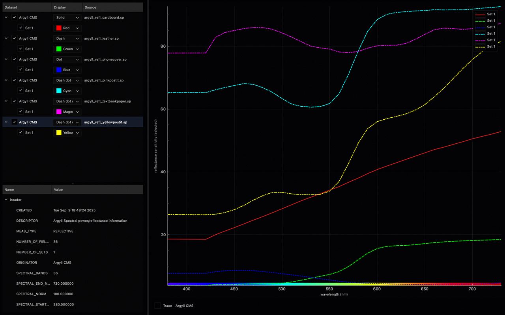

Specviz
==================

[](https://github.com/mikaelsundell/brawtool/blob/master/README.md)

Introduction
------------



This project is an experimental exploration of spectral data visualization and interaction using C++ and Qt, serving as a lightweight alternative to existing scientific plotting tools. It acts as a testbed for parsing and analyzing spectral data files, with a focus on comparison, intuitive plotting, and interactive exploration.


Change log:

| Date       | Description                             |
|------------|-----------------------------------------|
| 2025-09-11 | First release 1.0.2 |
| 2025-09-05 | Project in development |

### Functionality

Specviz is a Qt-based application for viewing, comparing, and managing spectral datasets.  

- **Dataset Management**
  - Load spectral data files from multiple formats (e.g., AMPAS `.json`, Argyll `.sp`).
  - Drag-and-drop one or more files directly into the application.
  - Display dataset metadata (headers, origin, measurement type).
  - Export datasets back to supported formats.

- **Plotting and Visualization**
  - Interactive graph plotting using QCustomPlot.
  - Multiple datasets can be overlaid and toggled on/off.
  - Customizable line styles (solid, dash, dot, etc.).
  - Gradient bar visualization of the spectral wavelength range (380–780 nm).
   
- **Tracing Tools**
  - Mouse-over tracing: display exact X/Y values of datasets under the cursor.
  - Highlighted tracer markers with dataset and curve labels.
  - Status bar and dataset label update dynamically based on selection and trace.
  
- **Help and About**
  - About dialog with version, copyright, and third-party licenses (Qt, QCustomPlot).
  - Quick links to GitHub README and issue tracker.


### Spectral readings with X-Rite + ArgyllCMS

This project includes reference spectral measurements collected with an **X-Rite device** using **ArgyllCMS** tools.  
Both **reflective** and **ambient** measurements were taken to capture material reflectance and illuminant spectra.


#### Collecting spectral readings

**Calibration** 

   Before any measurement, the device must be calibrated:
   ```bash
   ./spotread -c
   ```
   (or follow the instrument’s instructions when prompted).

**Reflective sample** 

   To measure the reflectance of a physical sample (e.g., paper, leather, etc.):
   ```bash
   ./spotread -e -T
   ```
   - `-e` = output spectrum  
   - `-T` = reflective mode (target sample)  

   Place the device flat against the sample and press the enter key.

**Ambient light**

   To capture the spectrum of an illuminant (e.g., room light, lamp, monitor backlight):
   ```bash
   ./spotread -e -a
   ```
   - `-a` = ambient mode  

   Hold the device toward the light source during measurement.

#### Available spectral sample files

| Date       | Description                      | Type       | Notes                                   |
|------------|----------------------------------|------------|-----------------------------------------|
| 2025-09-11 | [argyll_amb_copybox.sp](data/argyll_amb_copybox.sp)        | Ambient    | Fluorescent copy box light source       |
| 2025-09-11 | [argyll_amb_negsupply97cri.sp](data/argyll_amb_negsupply97cri.sp) | Ambient    | High-CRI negative supply illuminant     |
| 2025-09-11 | [argyll_refl_cardboard.sp](data/argyll_refl_cardboard.sp)  | Reflective | Brown cardboard sample                  |
| 2025-09-11 | [argyll_refl_leather.sp](data/argyll_refl_leather.sp)      | Reflective | Black leather cover sample              |
| 2025-09-11 | [argyll_refl_phonecover.sp](data/argyll_refl_phonecover.sp) | Reflective | Plastic phone cover (dark surface)      |
| 2025-09-11 | [argyll_refl_pinkpostit.sp](data/argyll_refl_pinkpostit.sp) | Reflective | Fluorescent pink Post-it note           |
| 2025-09-11 | [argyll_refl_textbookpaper.sp](data/argyll_refl_textbookpaper.sp) | Reflective | White textbook paper                    |
| 2025-09-11 | [argyll_refl_yellowpostit.sp](data/argyll_refl_yellowpostit.sp) | Reflective | Yellow Post-it note                     |


**Notice**  
- Ambient files (`_amb_`) represent **illuminant spectra**.  
- Reflective files (`_refl_`) represent **sample reflectance curves**.  
- Measurements below ~420 nm (e.g. 380–410 nm) often appear **flat-lined** due to limited instrument sensitivity in the near-UV range.

These datasets can be loaded directly into **Specviz** to visualize and compare the spectral responses.

References
-------------

* Qt6 documentation    
https://doc.qt.io/qt-6

* QCustomPlot   
https://www.qcustomplot.com/

Project
-------

* GitHub page   
https://github.com/mikaelsundell/specviz

* Issues   
https://github.com/mikaelsundell/specviz/issues

## License ##

3rdparty packages and their copyrights:

Qt Toolkit
Copyright (C) 2025 The Qt Company Ltd. and/or its subsidiary(-ies).    
Qt is licensed under the GNU Lesser General Public License (LGPL) version 3.    
For details, see https://www.qt.io/licensing/ and https://doc.qt.io/qt-6/lgpl.html

QCustomPlot
Copyright (C) 2011-2025 Emanuel Eichhammer   
QCustomPlot is licensed under the GNU General Public License (GPL) version 3.   
or a commercial license.    
For details, see https://www.qcustomplot.com/

-------
README crafted with a little help from ChatGPT