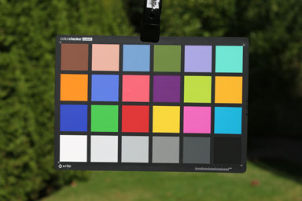
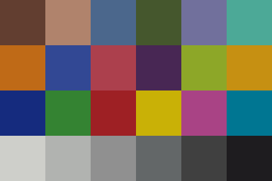

ColorChecker Sekonic C700 validation
===================================



*Figure 1 - ColorChecker photographed with Canon 5D under measured Sekonic C-700 illuminant in sRGB.*



*Figure 2 — Spectrally synthesized ColorChecker under measured Sekonic C-700 illuminant in sRGB.*

This example demonstrates how to **digitize an approximate spectral power distribution (SPD) from a Sekonic C-700 spectrum image** and use it together with measured reflectance data and CIE color matching functions to perform **end-to-end colorimetric validation**.

The purpose is **not to recover exact instrument-grade spectral data**, but to construct a **reasonable spectral approximation** suitable for:

- validating color science implementations
- testing colorimetric pipelines
- and visualizing expected color appearance under a measured illuminant

This repository therefore functions as a **small, self-contained spectral test program** rather than a measurement tool.

## Purpose

- Approximate **illuminant spectral power distribution (SPD)** from a Sekonic C-700 screenshot.
- Combine the illuminant with **measured ColorChecker reflectance spectra**.
- Convert illuminated spectra into **CIE XYZ tristimulus values** using standard CMFs.
- Validate downstream color processing stages, including:
  - normalization / exposure anchoring
  - chromatic adaptation
  - XYZ → sRGB conversion
- Provide a reproducible reference for **color pipeline verification** (e.g. camera, DCC, or rendering pipelines).

This example acts as a bridge between:

- Instrument screenshots  
- Spectral mathematics  
- Practical color validation workflows  

## Overview of the Pipeline

1. Reflectance spectra (ColorChecker)
2. Illuminant SPD (Sekonic C-700, digitized)
3. Reflectance × illuminant per wavelength
4. Integration against CIE CMFs → XYZ
5. Illuminant white (perfect diffuser)
6. Bradford chromatic adaptation → D65
7. White normalization using ColorChecker patch #19
8. Display mapping (XYZ → sRGB)

## Usage

### Digitize the Sekonic C-700 spectrum

```bash
python3 sekonic_c-700-digitize_spectrum_image.py ./sekonic_c-700_5392K_SpectralDistribution.jpg
```

### Run the spectral test program

The C++ example consumes:

- ColorChecker reflectance CSV
- Digitized illuminant SPD CSV
- CIE CMF CSV

and outputs per-patch XYZ values and an sRGB ColorChecker image.

## Reference Data and File Sources

### Sekonic C-700 Illuminant Spectrum

- Source: Sekonic C-700 spectrum screenshot
- Method: Manual digitization from image
- Files:
  - sekonic_c-700_<CCT>_SpectralDistribution_*.csv
- Notes:
  - Relative spectral shape only
  - Not radiometrically calibrated

### CIE Color Matching Functions (CMFs)

Provided by the Colour & Vision Research Laboratory (CVRL), University College London:

http://cvrl.ucl.ac.uk/cmfs.htm

- CIE 1931 2° Standard Observer
- XYZ color matching functions
- Modified by Judd (1951) and Vos (1978)

Files contain wavelength, x̄(λ), ȳ(λ), z̄(λ).

### ColorChecker Classic Reflectance Spectra

Source: BabelColor

https://babelcolor.com/colorchecker-2.htm

- ColorChecker Classic (24 patches)
- Spectral reflectance data
- 380–780 nm, 10 nm sampling

Files:
- colorchecker-classic_10nm.csv

## Notes and Limitations

- Illuminant SPD is approximate.
- Absolute photometric accuracy is not the goal.
- Sampling resolution is sufficient for CMF integration.
- Intended for validation and educational use.

## Summary

This project demonstrates how approximate real-world spectral data can be
combined with measured reflectance and standard observer functions to construct
a complete, inspectable colorimetric pipeline.
